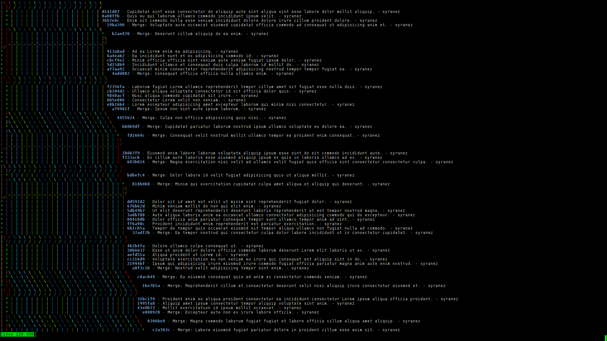

# git-branch-tube
A bash script to generate a git repo with lots of commits, branches and merges.

## Installation

    npm install

## Usage

    ./index.bash && npm run show

## License

[MIT](http://opensource.org/licenses/MIT)
